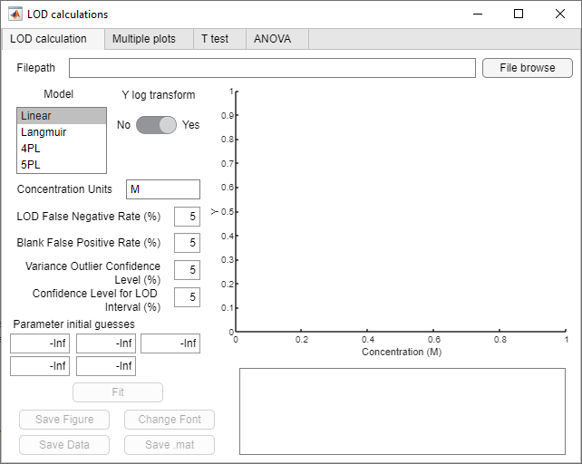
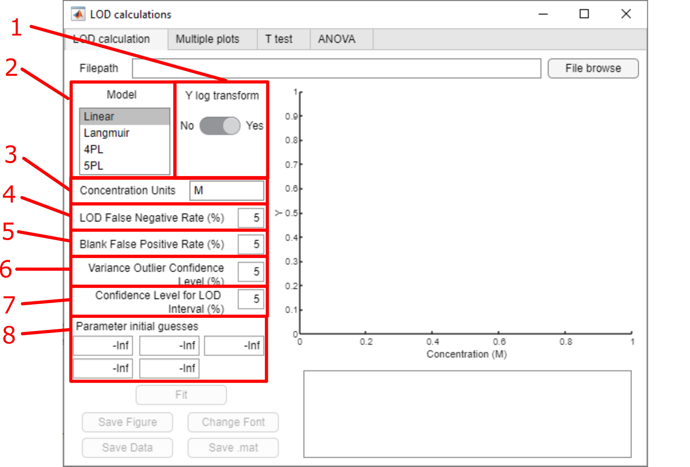
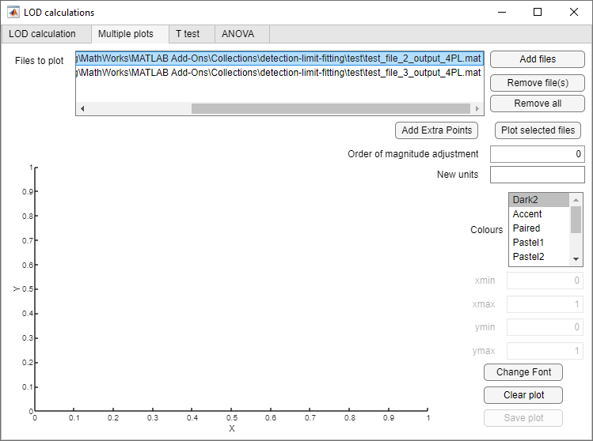
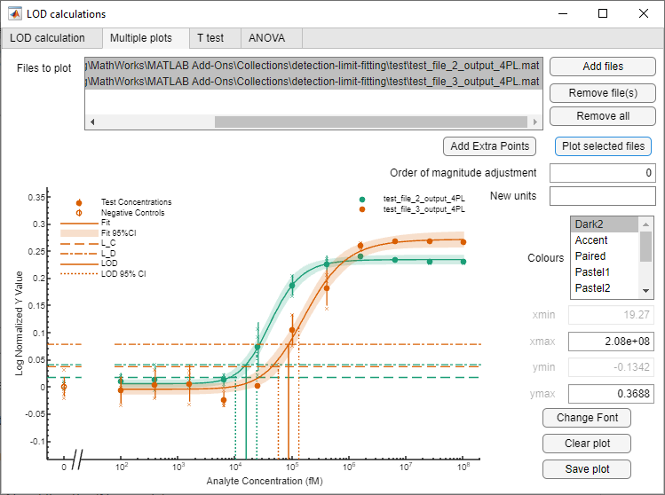

# detection-limit-fitting
Software for fitting robust detection limits (LODs) to serial dilution data. Fits can then be plotted individually or multiple on the same axes, and compared using t tests.

## Discussions

If you have feature requests or questions, or would like to get help with problem or report a bug, please use the discussions tab.

## Installation
### Matlab app install (multiplatform)
If you use Matlab and want to use the app inside Matlab, download build/LOD_calculations_beta_1.mlappinstall. Open with Matlab and it will install in My Apps with the name "LOD_calculations_beta_1". It can then be found and opened from the APPS tab in Matlab.

Alternatively, open Matlab and click Add-Ons. Search for "Detection Limit Fitting Tool" and add to Matlab.

### Windows standalone installation
If you want to use it as a standalone application in Windows, download build/LOD_calculations_beta_1.exe. Open and run and it will install as a standalone application.

### Mac standalone installation
Coming soon...

## Usage
The application has three tabs:

1. LOD calculation: for importing dilution series data and fitting to a choice of four models. Fits, data and plots can then be exported in various formats.
2. Multiple plots: for plotting multiple datasets and fits on the same axes.
3. T tests: for performing statistical comparisons of LODs. Note: it is possible to compare multiple datasets to a single dataset by individual t tests, but this is only robust when comparing multiple independent datasets to a single control dataset.

### Data format
Data must be in .xlsx files with two columns. Column 1 must be concentration values and column 2 must be the corresponding signal values. Column headings are optional (see example files in /test), described below in 'Test Files' section.

### LOD calculation

Click 'File browse' to select a file. There are then multiple parameters to select:
1. Model: chose between the four models. See https://doi.org/10.1016/j.bios.2022.114133 for descriptions of the models.
2. Concentration units: input the units of your analyte concentrations.
3. LOD False Negative Rate (%): input the value for the confidence level of a positive sample at the LOD (lower value gives higher LOD and a higher probability that a negative result is a real negative).
4. Blank False Positive Rate (%): input the value for the confidence level of the blank cutoff (lower value gives a high blank cutoff and higher LOD, giving a higher probability that a positive result is a real positive).
5. Variance Outlier Confidence Level (%): when finding the 'characteristic variance' to calculate the cutoff, a hypothesis test (G test) is performed to exclude outlier variances. This is the confidence level of that hypothesis test. See https://doi.org/10.1016/j.bios.2022.114133 for more details.
6. Confidence Level for LOD Interval (%): confidence level for the confidence interval of the LOD.

Then click 'Fit'

The data and fitted model should be plotted in the box on the left, and the LOD and fit statistics in the box underneath.

If the fit is unsuccessful, try a different model. If still unsuccessful, please use the forum to discuss.

Save Figure: to save the plot in various formats

Save Data: Export a .xlsx file of the data, LOD, fitted parameters and statistics.

Save .mat: Save data, LOD, fitted parameters and statistics in a .mat file. This is required for Multiple plots and T tests functionality.

### Multiple plots

Click 'Add files' to add multiple files (either at once or can be added sequentially). The files must be the .mat files saved previously in the 'LOD calculation' tab.

When all the files are loaded, use Ctrl/Shift and click to select which files to plot.

Then select 'Colours' to choose the colourscheme. They are ColorBrewer schemes (can be browsed here: https://colorbrewer2.org/)

Click 'Plot selected files'

Save or clear plot using the buttons on the bottom right.

### T tests
Select the comparator (control) file, to which all other files will be compared, using the 'Select file' button. The file must be a .mat file saved previously in the 'LOD calculation' tab.

Select single or multiple comparison files using the 'Select file(s)' button. The files must be the .mat files saved previously in the 'LOD calculation' tab.

Set the confidence level for the LOD confidence intervals.

As previously, select which files to compare and click 'Compare'. Note: each file must have a unique name otherwise it will not run.

The results appear in a table below. They can then be exported to a .xlsx file.

## Test files
### Linear model fit

Use test_file_1.xlsx. Use model "Linear", and concentration units "zM"

Data from: Miller, B.S., Bezinge, L., Gliddon, H.D. et al. Spin-enhanced nanodiamond biosensing for ultrasensitive diagnostics. Nature 587, 588–593 (2020). https://doi.org/10.1038/s41586-020-2917-1
### Langmuir, 4PL and 5PL fits

Use test_file_2.xlsx. Use model "Langmuir", "4PL" or "5PL" and concentration units "fM"

Data from: Benjamin S. Miller, Michael R. Thomas, Matthew Banner et al. Sub-picomolar lateral flow antigen detection with two-wavelength imaging of composite nanoparticles. Biosensors and Bioelectronics, 114133 (2022). https://doi.org/10.1016/j.bios.2022.114133

## Authors and References

Original code developed by Carly Holstein, Department of Bioengineering, and Maryclare Griffin, Department of Statistics

Copyright Carly Holstein, University of Washington, 2014-2015

Originally published: Carly A. Holstein, Maryclare Griffin et al. Statistical Method for Determining and Comparing Limits of Detection of Bioassays. Analytical Chemistry 2015 87 (19), 9795-9801. https://doi.org/10.1021/acs.analchem.5b02082

Extended code and GUI app developed by Benjamin S Miller, London Centre for Nanotechnology, University College London

Copyright Benjamin S Miller, University College London, 2022

Published: Benjamin S. Miller, Michael R. Thomas, Matthew Banner et al. Sub-picomolar lateral flow antigen detection with two-wavelength imaging of composite nanoparticles. Biosensors and Bioelectronics, 114133 (2022). https://doi.org/10.1016/j.bios.2022.114133

Other functions used:

Adam Danz (2022). copyUIAxes (https://www.mathworks.com/matlabcentral/fileexchange/73103-copyuiaxes), MATLAB Central File Exchange.

Stephen (2022). ColorBrewer: Attractive and Distinctive Colormaps (https://github.com/DrosteEffect/BrewerMap/releases/tag/3.2.3), GitHub.

Antonio Trujillo-Ortiz (2022). gtlaminv (https://www.mathworks.com/matlabcentral/fileexchange/45943-gtlaminv), MATLAB Central File Exchange.

Antonio Trujillo-Ortiz (2022). gtlamtest (https://www.mathworks.com/matlabcentral/fileexchange/52436-gtlamtest), MATLAB Central File Exchange.
